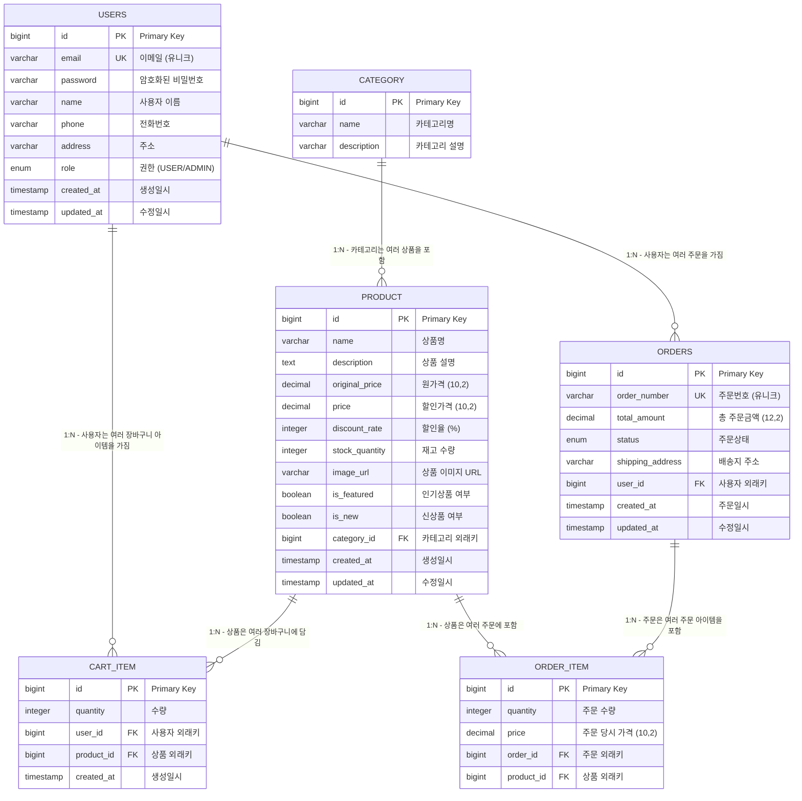

# 📊 E-Commerce 데이터베이스 설계 (ERD)

## 📋 테이블 개요

| 테이블명 | 설명 | 주요 기능 |
|---------|------|---------|
| `users` | 사용자 정보 | 회원가입, 로그인, 프로필 관리 |
| `category` | 상품 카테고리 | 상품 분류 관리 |
| `product` | 상품 정보 | 상품 관리, 할인율 계산 |
| `cart_item` | 장바구니 아이템 | 장바구니 관리 |
| `orders` | 주문 정보 | 주문 생성, 상태 관리 |
| `order_item` | 주문 상품 상세 | 주문한 상품 정보 |

## 🗂️ 상세 ERD



## 📝 테이블 상세 명세

### 1. USERS (사용자)
```sql
CREATE TABLE users (
    id BIGINT AUTO_INCREMENT PRIMARY KEY,
    email VARCHAR(255) NOT NULL UNIQUE,
    password VARCHAR(255) NOT NULL,
    name VARCHAR(255) NOT NULL,
    phone VARCHAR(255),
    address VARCHAR(255),
    role ENUM('USER', 'ADMIN') DEFAULT 'USER',
    created_at TIMESTAMP DEFAULT CURRENT_TIMESTAMP,
    updated_at TIMESTAMP DEFAULT CURRENT_TIMESTAMP ON UPDATE CURRENT_TIMESTAMP,
    
    INDEX idx_users_email (email),
    INDEX idx_users_role (role)
);
```

### 2. CATEGORY (카테고리)
```sql
CREATE TABLE category (
    id BIGINT AUTO_INCREMENT PRIMARY KEY,
    name VARCHAR(255) NOT NULL,
    description VARCHAR(255),
    
    INDEX idx_category_name (name)
);
```

### 3. PRODUCT (상품)
```sql
CREATE TABLE product (
    id BIGINT AUTO_INCREMENT PRIMARY KEY,
    name VARCHAR(255) NOT NULL,
    description TEXT,
    original_price DECIMAL(10,2) NOT NULL,
    price DECIMAL(10,2) NOT NULL,
    discount_rate INTEGER,
    stock_quantity INTEGER NOT NULL DEFAULT 0,
    image_url VARCHAR(255),
    is_featured BOOLEAN NOT NULL DEFAULT FALSE,
    is_new BOOLEAN NOT NULL DEFAULT FALSE,
    category_id BIGINT,
    created_at TIMESTAMP DEFAULT CURRENT_TIMESTAMP,
    updated_at TIMESTAMP DEFAULT CURRENT_TIMESTAMP ON UPDATE CURRENT_TIMESTAMP,
    
    FOREIGN KEY (category_id) REFERENCES category(id) ON DELETE SET NULL,
    INDEX idx_product_name (name),
    INDEX idx_product_category (category_id),
    INDEX idx_product_featured (is_featured),
    INDEX idx_product_new (is_new),
    INDEX idx_product_price (price),
    INDEX idx_product_created (created_at)
);
```

### 4. CART_ITEM (장바구니 아이템)
```sql
CREATE TABLE cart_item (
    id BIGINT AUTO_INCREMENT PRIMARY KEY,
    quantity INTEGER NOT NULL DEFAULT 1,
    user_id BIGINT NOT NULL,
    product_id BIGINT NOT NULL,
    created_at TIMESTAMP DEFAULT CURRENT_TIMESTAMP,
    
    FOREIGN KEY (user_id) REFERENCES users(id) ON DELETE CASCADE,
    FOREIGN KEY (product_id) REFERENCES product(id) ON DELETE CASCADE,
    UNIQUE KEY uk_cart_user_product (user_id, product_id),
    INDEX idx_cart_user (user_id),
    INDEX idx_cart_product (product_id)
);
```

### 5. ORDERS (주문)
```sql
CREATE TABLE orders (
    id BIGINT AUTO_INCREMENT PRIMARY KEY,
    order_number VARCHAR(255) NOT NULL UNIQUE,
    total_amount DECIMAL(12,2) NOT NULL,
    status ENUM('PENDING', 'CONFIRMED', 'PROCESSING', 'SHIPPED', 'DELIVERED', 'CANCELLED') DEFAULT 'PENDING',
    shipping_address VARCHAR(255),
    user_id BIGINT NOT NULL,
    created_at TIMESTAMP DEFAULT CURRENT_TIMESTAMP,
    updated_at TIMESTAMP DEFAULT CURRENT_TIMESTAMP ON UPDATE CURRENT_TIMESTAMP,
    
    FOREIGN KEY (user_id) REFERENCES users(id) ON DELETE CASCADE,
    INDEX idx_orders_number (order_number),
    INDEX idx_orders_user (user_id),
    INDEX idx_orders_status (status),
    INDEX idx_orders_created (created_at)
);
```

### 6. ORDER_ITEM (주문 아이템)
```sql
CREATE TABLE order_item (
    id BIGINT AUTO_INCREMENT PRIMARY KEY,
    quantity INTEGER NOT NULL,
    price DECIMAL(10,2) NOT NULL,
    order_id BIGINT NOT NULL,
    product_id BIGINT NOT NULL,
    
    FOREIGN KEY (order_id) REFERENCES orders(id) ON DELETE CASCADE,
    FOREIGN KEY (product_id) REFERENCES product(id) ON DELETE RESTRICT,
    INDEX idx_order_item_order (order_id),
    INDEX idx_order_item_product (product_id)
);
```

## 🔗 관계 설명

### 1. 사용자 ↔ 장바구니 (1:N)
- 한 사용자는 여러 장바구니 아이템을 가질 수 있음
- 사용자 삭제 시 관련 장바구니 아이템도 함께 삭제 (CASCADE)

### 2. 사용자 ↔ 주문 (1:N)
- 한 사용자는 여러 주문을 할 수 있음
- 사용자 삭제 시 관련 주문도 함께 삭제 (CASCADE)

### 3. 카테고리 ↔ 상품 (1:N)
- 한 카테고리에는 여러 상품이 속할 수 있음
- 카테고리 삭제 시 상품의 카테고리는 NULL로 설정 (SET NULL)

### 4. 상품 ↔ 장바구니 아이템 (1:N)
- 한 상품은 여러 사용자의 장바구니에 담길 수 있음
- 상품 삭제 시 관련 장바구니 아이템도 함께 삭제 (CASCADE)

### 5. 상품 ↔ 주문 아이템 (1:N)
- 한 상품은 여러 주문에 포함될 수 있음
- 상품 삭제 방지 (RESTRICT) - 주문 이력 보존

### 6. 주문 ↔ 주문 아이템 (1:N)
- 한 주문에는 여러 상품이 포함될 수 있음
- 주문 삭제 시 관련 주문 아이템도 함께 삭제 (CASCADE)

## 🎯 비즈니스 규칙

### 할인 시스템
1. **원가격 > 할인가격**: 반드시 원가격이 할인가격보다 커야 함
2. **할인율 계산**: `((원가격 - 할인가격) / 원가격) * 100`
3. **할인율 범위**: 0% ~ 99% (음수나 100% 이상 불가)

### 재고 관리
1. **재고 확인**: 장바구니 담기/주문 시 재고 수량 검증
2. **재고 차감**: 주문 확정 시 재고 자동 차감
3. **재고 복원**: 주문 취소 시 재고 자동 복원

### 주문 상태 흐름
```
PENDING → CONFIRMED → PROCESSING → SHIPPED → DELIVERED
    ↓
CANCELLED (PENDING 상태에서만 가능)
```

### 장바구니 제약
1. **중복 방지**: 같은 사용자가 같은 상품을 중복으로 담을 수 없음
2. **수량 제한**: 최소 1개 이상, 재고 수량 이하
3. **자동 정리**: 상품 삭제 시 관련 장바구니 아이템 자동 제거

## 📊 인덱스 전략

### 성능 최적화를 위한 인덱스
1. **검색 최적화**: 상품명, 카테고리별 검색
2. **정렬 최적화**: 생성일, 가격별 정렬
3. **필터링 최적화**: 인기상품, 신상품 필터
4. **조인 최적화**: 외래키 인덱스

### 복합 인덱스
```sql
-- 장바구니 중복 방지
CREATE UNIQUE INDEX uk_cart_user_product ON cart_item(user_id, product_id);

-- 상품 검색 최적화
CREATE INDEX idx_product_category_featured ON product(category_id, is_featured);
CREATE INDEX idx_product_category_new ON product(category_id, is_new);
```

## 🔒 보안 고려사항

### 데이터 보안
1. **비밀번호**: BCrypt 해싱 (Spring Security 기본)
2. **개인정보**: 민감 정보 암호화 (필요시)
3. **SQL 인젝션**: PreparedStatement 사용

### 접근 제어
1. **인증**: JWT 토큰 기반
2. **권한**: ROLE 기반 접근 제어
3. **API 보안**: Spring Security 적용

### 데이터 무결성
1. **외래키 제약**: 참조 무결성 보장
2. **체크 제약**: 비즈니스 룰 검증
3. **트랜잭션**: ACID 속성 보장

---

## 📈 확장 고려사항

### 향후 추가 가능한 테이블
1. **product_image**: 상품 다중 이미지
2. **review**: 상품 리뷰/평점
3. **coupon**: 쿠폰/할인코드
4. **wishlist**: 찜 목록
5. **notification**: 알림 시스템
6. **audit_log**: 데이터 변경 이력

### 성능 최적화
1. **읽기 전용 복제본**: 조회 성능 향상
2. **캐싱**: Redis 등을 이용한 캐시 레이어
3. **파티셔닝**: 대용량 데이터 처리
4. **아카이빙**: 오래된 주문 데이터 별도 저장 