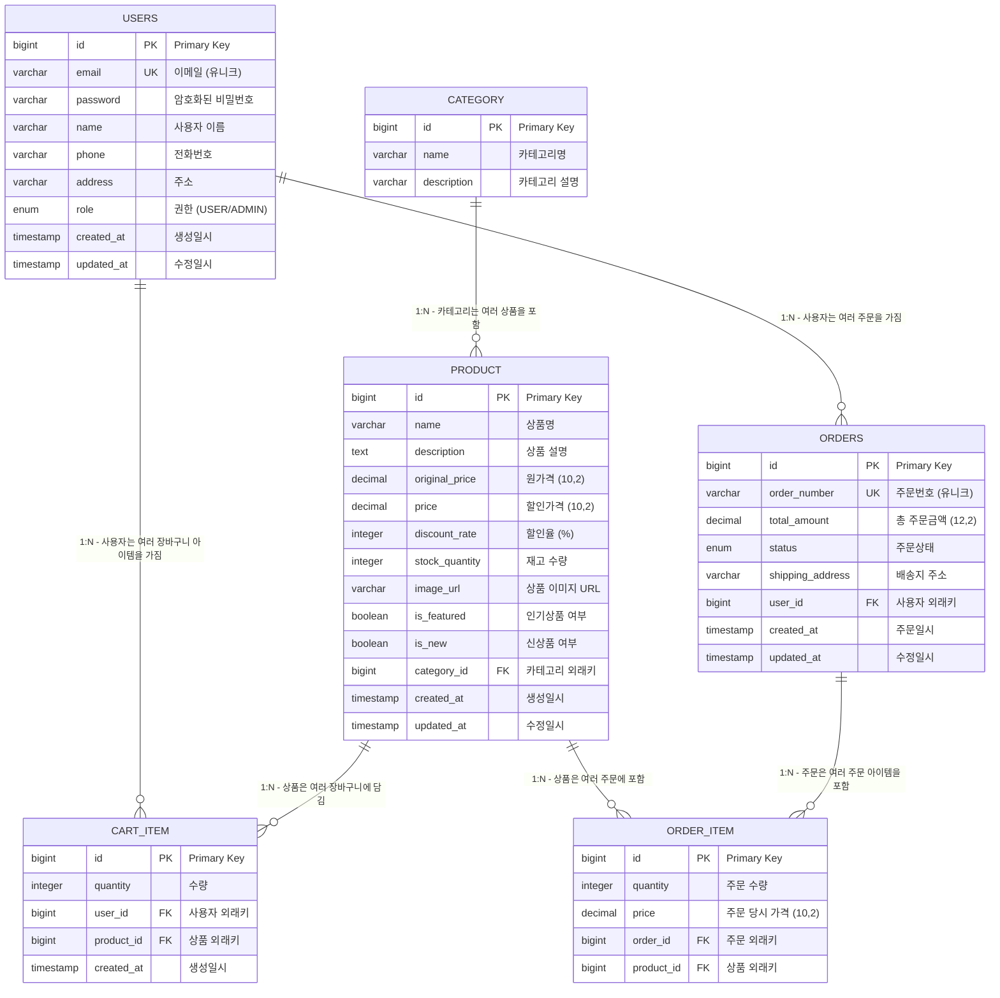

# 🛒 E-Commerce 쇼핑몰 프로젝트

<div align="center">


**Spring Boot + React로 구현한 풀스택 쇼핑몰 시스템**

실무에서 사용하는 주요 기능들을 모두 포함한 완전한 이커머스 플랫폼입니다.

[🚀 데모 보기](#-데모) • [📋 기능 목록](#-주요-기능) • [🛠️ 기술 스택](#️-기술-스택) • [📖 문서](#-문서)

</div>

---

## 📋 목차

- [프로젝트 개요](#-프로젝트-개요)
- [주요 기능](#-주요-기능)
- [기술 스택](#️-기술-스택)
- [프로젝트 구조](#-프로젝트-구조)
- [설치 및 실행](#-설치-및-실행)
- [API 문서](#-api-문서)
- [데이터베이스 설계](#-데이터베이스-설계)
- [주요 페이지](#-주요-페이지)
- [핵심 기능 설명](#-핵심-기능-설명)
- [개발 환경](#-개발-환경)
- [배포 가이드](#-배포-가이드)
- [기여 가이드](#-기여-가이드)
- [라이선스](#-라이선스)

---

## 🎯 프로젝트 개요

이 프로젝트는 **Spring Boot 3.2**와 **React 19**를 사용하여 구현한 완전한 이커머스 쇼핑몰 시스템입니다.

### ✨ 특징
- 🔐 **JWT 기반 인증/인가 시스템**
- 🛒 **실시간 장바구니 관리**
- 📦 **상품 관리 및 할인 시스템**
- 📋 **주문 및 재고 관리**
- 👨‍💼 **관리자 대시보드**
- 📱 **반응형 웹 디자인**
- 🔍 **실시간 검색 및 필터링**

---

## 🚀 주요 기능

### 👤 사용자 기능
- [x] **회원가입/로그인**: JWT 토큰 기반 인증
- [x] **프로필 관리**: 개인정보 수정
- [x] **상품 조회**: 목록, 상세, 검색, 필터링
- [x] **장바구니**: 상품 추가/수정/삭제, 수량 조절
- [x] **주문 관리**: 주문 생성, 조회, 취소
- [x] **주문 내역**: 개인 주문 히스토리

### 👨‍💼 관리자 기능
- [x] **상품 관리**: CRUD, 할인율 설정, 재고 관리
- [x] **카테고리 관리**: 상품 분류 시스템
- [x] **주문 관리**: 전체 주문 조회, 상태 변경
- [x] **파일 업로드**: 상품 이미지 업로드
- [x] **통계 대시보드**: 매출, 주문 현황

### 🛍️ 쇼핑 기능
- [x] **상품 분류**: 인기상품, 신상품 태깅
- [x] **할인 시스템**: 동적 할인율 계산
- [x] **검색 기능**: 실시간 검색 (최소 2글자)
- [x] **필터링**: 카테고리별, 가격별 필터
- [x] **페이징**: 페이지네이션 지원
- [x] **슬라이더**: 홈페이지 상품 슬라이더

---

## 🛠️ 기술 스택

### Backend
| 기술 | 버전 | 설명 |
|------|------|------|
| **Spring Boot** | 3.2.0 | 웹 애플리케이션 프레임워크 |
| **Spring Security** | 6.2.0 | 인증 및 권한 관리 |
| **Spring Data JPA** | 3.2.0 | 데이터 접근 계층 |
| **Hibernate** | 6.3.1 | ORM 프레임워크 |
| **JWT** | 0.12.3 | 토큰 기반 인증 |
| **H2 Database** | 2.2.224 | 인메모리 데이터베이스 |
| **MySQL** | 8.1.0 | 운영 데이터베이스 |
| **Maven** | 3.9.11 | 빌드 도구 |
| **Java** | 17 | 프로그래밍 언어 |

### Frontend
| 기술 | 버전 | 설명 |
|------|------|------|
| **React** | 19.1.0 | 사용자 인터페이스 라이브러리 |
| **React Router** | 6.30.1 | 클라이언트 사이드 라우팅 |
| **Tailwind CSS** | 4.1.11 | 유틸리티 기반 CSS 프레임워크 |
| **Vite** | 7.0.4 | 빌드 도구 및 개발 서버 |
| **Axios** | 1.11.0 | HTTP 클라이언트 |

### 개발 도구
| 도구 | 설명 |
|------|------|
| **ESLint** | JavaScript 코드 품질 관리 |
| **PostCSS** | CSS 전처리기 |
| **Autoprefixer** | CSS 벤더 프리픽스 자동 추가 |

---

## 📁 프로젝트 구조

```
etc/
├── 📁 frontend/                    # React 프론트엔드
│   ├── 📁 public/                 # 정적 파일
│   ├── 📁 src/
│   │   ├── 📁 components/         # 재사용 컴포넌트
│   │   │   ├── Header.jsx         # 헤더 컴포넌트
│   │   │   └── Footer.jsx         # 푸터 컴포넌트
│   │   ├── 📁 pages/              # 페이지 컴포넌트
│   │   │   ├── Home.jsx           # 홈페이지
│   │   │   ├── Products.jsx       # 상품 목록
│   │   │   ├── ProductDetail.jsx  # 상품 상세
│   │   │   ├── Cart.jsx           # 장바구니
│   │   │   ├── Login.jsx          # 로그인
│   │   │   ├── Register.jsx       # 회원가입
│   │   │   └── AdminManagement.jsx # 관리자 페이지
│   │   ├── 📁 services/           # API 서비스
│   │   │   ├── api.js             # API 설정
│   │   │   ├── authService.js     # 인증 서비스
│   │   │   ├── productService.js  # 상품 서비스
│   │   │   └── cartService.js     # 장바구니 서비스
│   │   └── 📁 utils/              # 유틸리티 함수
│   ├── package.json               # 프론트엔드 의존성
│   ├── vite.config.js             # Vite 설정
│   └── tailwind.config.js         # Tailwind CSS 설정
│
├── 📁 src/                        # Spring Boot 백엔드
│   └── 📁 main/
│       ├── 📁 java/com/shop/
│       │   ├── 📁 config/         # 설정 클래스
│       │   │   ├── SecurityConfig.java      # 보안 설정
│       │   │   └── PasswordConfig.java      # 비밀번호 설정
│       │   ├── 📁 controller/     # REST API 컨트롤러
│       │   │   ├── AuthController.java      # 인증 API
│       │   │   ├── ProductController.java   # 상품 API
│       │   │   ├── CartController.java      # 장바구니 API
│       │   │   ├── OrderController.java     # 주문 API
│       │   │   ├── UserController.java      # 사용자 API
│       │   │   ├── CategoryController.java  # 카테고리 API
│       │   │   └── FileUploadController.java # 파일 업로드 API
│       │   ├── 📁 dto/            # 데이터 전송 객체
│       │   │   ├── AuthRequest.java         # 인증 요청 DTO
│       │   │   ├── ProductDto.java          # 상품 DTO
│       │   │   ├── CartItemDto.java         # 장바구니 DTO
│       │   │   ├── OrderDto.java            # 주문 DTO
│       │   │   └── FileUploadResponse.java  # 파일 업로드 응답 DTO
│       │   ├── 📁 entity/         # JPA 엔티티
│       │   │   ├── User.java               # 사용자 엔티티
│       │   │   ├── Product.java            # 상품 엔티티
│       │   │   ├── Category.java           # 카테고리 엔티티
│       │   │   ├── CartItem.java           # 장바구니 아이템 엔티티
│       │   │   ├── Order.java              # 주문 엔티티
│       │   │   └── OrderItem.java          # 주문 아이템 엔티티
│       │   ├── 📁 exception/      # 예외 처리
│       │   │   ├── GlobalExceptionHandler.java # 전역 예외 처리
│       │   │   └── ErrorResponse.java       # 에러 응답 DTO
│       │   ├── 📁 repository/     # 데이터 접근 계층
│       │   │   ├── UserRepository.java      # 사용자 리포지토리
│       │   │   ├── ProductRepository.java   # 상품 리포지토리
│       │   │   ├── CategoryRepository.java  # 카테고리 리포지토리
│       │   │   ├── CartItemRepository.java  # 장바구니 리포지토리
│       │   │   ├── OrderRepository.java     # 주문 리포지토리
│       │   │   └── OrderItemRepository.java # 주문 아이템 리포지토리
│       │   ├── 📁 security/       # 보안 관련
│       │   │   ├── JwtUtil.java            # JWT 유틸리티
│       │   │   └── JwtAuthenticationFilter.java # JWT 인증 필터
│       │   ├── 📁 service/        # 비즈니스 로직
│       │   │   ├── AuthService.java        # 인증 서비스
│       │   │   ├── ProductService.java     # 상품 서비스
│       │   │   ├── CartService.java        # 장바구니 서비스
│       │   │   ├── OrderService.java       # 주문 서비스
│       │   │   ├── UserService.java        # 사용자 서비스
│       │   │   ├── CategoryService.java    # 카테고리 서비스
│       │   │   └── FileUploadService.java  # 파일 업로드 서비스
│       │   └── ShoppingMallApplication.java # 메인 애플리케이션
│       └── 📁 resources/          # 리소스 파일
│           ├── application.yml    # 애플리케이션 설정
│           └── data.sql           # 초기 데이터
│
├── 📄 pom.xml                     # Maven 설정
├── 📄 ERD.md                      # 데이터베이스 설계 문서
├── 📄 API_SPECIFICATION.md        # API 명세서
└── 📄 README.md                   # 프로젝트 문서
```

---

## 🚀 설치 및 실행

### 사전 요구사항
- **Java 17** 이상
- **Node.js 18** 이상
- **npm** 또는 **yarn**

### 1. 프로젝트 클론
```bash
git clone <repository-url>
cd etc
```

### 2. 백엔드 실행
```bash
# 프로젝트 루트에서
mvn clean install
mvn spring-boot:run
```

### 3. 프론트엔드 실행
```bash
cd frontend
npm install
npm run dev
```

### 4. 접속 정보
- **프론트엔드**: http://localhost:5173
- **백엔드 API**: http://localhost:8080
- **H2 데이터베이스 콘솔**: http://localhost:8080/h2-console
    - JDBC URL: `jdbc:h2:mem:testdb`
    - Username: `sa`
    - Password: (비어있음)

---

## 🔐 테스트 계정

### 관리자 계정
- **이메일**: `admin@shop.com`
- **비밀번호**: `admin123`

### 일반 사용자 계정
- **이메일**: `user@shop.com`
- **비밀번호**: `user123`

---

## 📚 API 문서

### 🔐 인증 API
| Method | Endpoint | Description | Auth Required |
|--------|----------|-------------|---------------|
| `POST` | `/api/auth/signup` | 회원가입 | ❌ |
| `POST` | `/api/auth/login` | 로그인 | ❌ |

### 👤 사용자 API
| Method | Endpoint | Description | Auth Required |
|--------|----------|-------------|---------------|
| `GET` | `/api/users/profile` | 프로필 조회 | ✅ |
| `PUT` | `/api/users/profile` | 프로필 수정 | ✅ |

### 📦 상품 API
| Method | Endpoint | Description | Auth Required |
|--------|----------|-------------|---------------|
| `GET` | `/api/products` | 상품 목록 조회 (페이징, 검색, 필터링) | ❌ |
| `GET` | `/api/products/{id}` | 상품 상세 조회 | ❌ |
| `GET` | `/api/products/featured` | 인기상품 목록 | ❌ |
| `GET` | `/api/products/new` | 신상품 목록 | ❌ |
| `POST` | `/api/products` | 상품 등록 | ✅ (관리자) |
| `PUT` | `/api/products/{id}` | 상품 수정 | ✅ (관리자) |
| `DELETE` | `/api/products/{id}` | 상품 삭제 | ✅ (관리자) |

### 🛒 장바구니 API
| Method | Endpoint | Description | Auth Required |
|--------|----------|-------------|---------------|
| `GET` | `/api/cart` | 장바구니 조회 | ✅ |
| `POST` | `/api/cart` | 장바구니 추가 | ✅ |
| `PUT` | `/api/cart/{id}` | 수량 변경 | ✅ |
| `DELETE` | `/api/cart/{id}` | 상품 제거 | ✅ |

### 📋 주문 API
| Method | Endpoint | Description | Auth Required |
|--------|----------|-------------|---------------|
| `GET` | `/api/orders` | 내 주문 목록 | ✅ |
| `POST` | `/api/orders` | 주문 생성 | ✅ |
| `GET` | `/api/orders/{id}` | 주문 상세 | ✅ |
| `PUT` | `/api/orders/{id}/cancel` | 주문 취소 | ✅ |

### 📁 파일 업로드 API
| Method | Endpoint | Description | Auth Required |
|--------|----------|-------------|---------------|
| `POST` | `/api/upload` | 파일 업로드 | ✅ (관리자) |
| `GET` | `/api/images/{filename}` | 이미지 조회 | ❌ |

> 📖 **상세 API 문서**: [API_SPECIFICATION.md](./API_SPECIFICATION.md)

---

## 🗄️ 데이터베이스 설계

### ERD 다이어그램



### 주요 테이블 설명

| 테이블 | 설명 | 주요 기능 |
|--------|------|---------|
| `users` | 사용자 정보 | 회원가입, 로그인, 프로필 관리 |
| `category` | 상품 카테고리 | 상품 분류 관리 |
| `product` | 상품 정보 | 상품 관리, 할인율 계산 |
| `cart_item` | 장바구니 아이템 | 장바구니 관리 |
| `orders` | 주문 정보 | 주문 생성, 상태 관리 |
| `order_item` | 주문 상품 상세 | 주문한 상품 정보 |

> 📊 **상세 ERD 문서**: [ERD.md](./ERD.md)

---

## 🎨 주요 페이지

### 일반 사용자 페이지
- **🏠 홈페이지**: 인기상품/신상품 슬라이더, 카테고리별 상품
- **📦 상품 목록**: 검색, 카테고리 필터링, 페이징, 정렬
- **🔍 상품 상세**: 상품 정보, 장바구니 담기, 수량 선택
- **🛒 장바구니**: 수량 조절, 총액 계산, 상품 제거
- **📋 주문 내역**: 주문 조회, 상태 확인, 주문 취소
- **👤 프로필**: 개인정보 수정, 주소 관리

### 관리자 페이지
- **📊 관리자 대시보드**: 상품/카테고리/주문 관리
- **📦 상품 관리**: 상품 CRUD, 할인율 설정, 재고 관리
- **🏷️ 카테고리 관리**: 카테고리 CRUD
- **📋 주문 관리**: 주문 상태 변경, 전체 주문 조회
- **📁 파일 업로드**: 상품 이미지 업로드

---

## 💡 핵심 기능 설명

### 🔐 인증/보안 시스템
- **JWT 토큰**: 무상태 인증 방식으로 서버 부하 최소화
- **역할 기반 접근 제어**: USER/ADMIN 권한 분리
- **토큰 만료**: 24시간 자동 만료로 보안 강화
- **CORS 설정**: 프론트엔드와의 원활한 통신

### 🛍️ 할인 시스템
- **원가격**: 상품의 정가 (할인 전 가격)
- **할인가격**: 실제 판매 가격
- **할인율**: `((원가격 - 할인가격) / 원가격) * 100` 자동 계산
- **동적 표시**: 할인이 있는 상품만 할인율 뱃지 표시

### 🛒 장바구니 시스템
- **실시간 업데이트**: 수량 변경 시 즉시 반영
- **중복 방지**: 같은 상품 중복 담기 방지
- **재고 검증**: 장바구니 담기 시 재고 확인
- **자동 정리**: 상품 삭제 시 관련 장바구니 아이템 자동 제거

### 📦 주문 시스템
- **주문 상태 관리**: PENDING → CONFIRMED → PROCESSING → SHIPPED → DELIVERED
- **재고 관리**: 주문 시 자동 차감, 취소 시 자동 복원
- **주문번호 생성**: 자동 주문번호 생성 (ORD-YYYYMMDD-XXX)
- **주문 취소**: PENDING 상태에서만 취소 가능

### 🔍 검색 및 필터링
- **실시간 검색**: 상품명 기반 부분 검색 (최소 2글자)
- **카테고리 필터**: 카테고리별 상품 필터링
- **가격 필터**: 가격대별 상품 필터링
- **정렬 기능**: 가격, 생성일, 인기도별 정렬

---

## 🛠️ 개발 환경

### 개발 도구
- **IDE**: IntelliJ IDEA, VS Code
- **데이터베이스**: H2 (개발), MySQL (운영)
- **API 테스트**: Postman, Insomnia
- **버전 관리**: Git

### 개발 환경 설정
```yaml
# application-dev.yml
spring:
  datasource:
    url: jdbc:h2:mem:testdb
    driver-class-name: org.h2.Driver
  jpa:
    hibernate:
      ddl-auto: create-drop
    show-sql: true
  h2:
    console:
      enabled: true
```

### 운영 환경 설정
```yaml
# application-prod.yml
spring:
  datasource:
    url: jdbc:mysql://localhost:3306/shopping_mall
    username: ${DB_USERNAME}
    password: ${DB_PASSWORD}
  jpa:
    hibernate:
      ddl-auto: validate
    show-sql: false
```

---

## 🚀 배포 가이드

### Docker 배포

#### 1. Dockerfile 생성
```dockerfile
# Backend Dockerfile
FROM openjdk:17-jdk-slim
COPY target/shopping-mall-*.jar app.jar
EXPOSE 8080
ENTRYPOINT ["java", "-jar", "/app.jar"]
```

#### 2. Docker Compose 설정
```yaml
version: '3.8'
services:
  backend:
    build: .
    ports:
      - "8080:8080"
    environment:
      - SPRING_PROFILES_ACTIVE=prod
      - DB_USERNAME=${DB_USERNAME}
      - DB_PASSWORD=${DB_PASSWORD}
    depends_on:
      - mysql
  
  mysql:
    image: mysql:8.0
    environment:
      - MYSQL_ROOT_PASSWORD=${MYSQL_ROOT_PASSWORD}
      - MYSQL_DATABASE=shopping_mall
    ports:
      - "3306:3306"
    volumes:
      - mysql_data:/var/lib/mysql

volumes:
  mysql_data:
```

### 클라우드 배포

#### AWS 배포
1. **EC2 인스턴스 생성**
2. **RDS MySQL 데이터베이스 설정**
3. **S3 버킷 생성** (이미지 저장용)
4. **CloudFront 설정** (CDN)

#### 배포 스크립트
```bash
#!/bin/bash
# deploy.sh

# 백엔드 빌드
mvn clean package -DskipTests

# Docker 이미지 빌드
docker build -t shopping-mall-backend .

# 컨테이너 실행
docker-compose up -d
```

---

## 🤝 기여 가이드

### 기여 방법
1. **Fork** 이 저장소
2. **Feature branch** 생성 (`git checkout -b feature/AmazingFeature`)
3. **Commit** 변경사항 (`git commit -m 'Add some AmazingFeature'`)
4. **Push** 브랜치 (`git push origin feature/AmazingFeature`)
5. **Pull Request** 생성

### 개발 가이드라인
- **코드 스타일**: Java는 Google Java Style Guide 준수
- **커밋 메시지**: Conventional Commits 형식 사용
- **테스트**: 새로운 기능에 대한 테스트 코드 작성
- **문서화**: API 변경 시 문서 업데이트

### 이슈 리포트
버그 리포트나 기능 요청은 [Issues](../../issues) 페이지를 이용해주세요.

---

## 📈 향후 개발 계획

### 🚀 단기 계획 (1-2개월)
- [ ] **파일 업로드 개선**: 다중 이미지 업로드
- [ ] **결제 시스템**: 토스페이먼츠, 아임포트 연동
- [ ] **이메일 알림**: 주문 확인, 배송 알림
- [ ] **리뷰 시스템**: 상품 리뷰 및 평점

### 🎯 중기 계획 (3-6개월)
- [ ] **고급 검색**: Elasticsearch 연동
- [ ] **분석 대시보드**: 매출, 상품 통계
- [ ] **쿠폰 시스템**: 할인 쿠폰 관리
- [ ] **위시리스트**: 찜 기능

### 🌟 장기 계획 (6개월 이상)
- [ ] **모바일 앱**: React Native 앱 개발
- [ ] **AI 추천**: 상품 추천 시스템
- [ ] **실시간 채팅**: 고객 상담 시스템
- [ ] **마이크로서비스**: 서비스 분리

---

## 📞 문의 및 지원

### 연락처
- **이메일**: [your-email@example.com](mailto:your-email@example.com)
- **GitHub Issues**: [Issues](../../issues)
- **Discussions**: [Discussions](../../discussions)

### 커뮤니티
- **기술 문의**: GitHub Issues 활용
- **기능 제안**: Discussions 활용
- **버그 리포트**: 상세한 재현 방법과 함께

---

## 📄 라이선스

이 프로젝트는 **MIT License** 하에 배포됩니다.

```
MIT License

Copyright (c) 2024 Shopping Mall Project

Permission is hereby granted, free of charge, to any person obtaining a copy
of this software and associated documentation files (the "Software"), to deal
in the Software without restriction, including without limitation the rights
to use, copy, modify, merge, publish, distribute, sublicense, and/or sell
copies of the Software, and to permit persons to whom the Software is
furnished to do so, subject to the following conditions:

The above copyright notice and this permission notice shall be included in all
copies or substantial portions of the Software.

THE SOFTWARE IS PROVIDED "AS IS", WITHOUT WARRANTY OF ANY KIND, EXPRESS OR
IMPLIED, INCLUDING BUT NOT LIMITED TO THE WARRANTIES OF MERCHANTABILITY,
FITNESS FOR A PARTICULAR PURPOSE AND NONINFRINGEMENT. IN NO EVENT SHALL THE
AUTHORS OR COPYRIGHT HOLDERS BE LIABLE FOR ANY CLAIM, DAMAGES OR OTHER
LIABILITY, WHETHER IN AN ACTION OF CONTRACT, TORT OR OTHERWISE, ARISING FROM,
OUT OF OR IN CONNECTION WITH THE SOFTWARE OR THE USE OR OTHER DEALINGS IN THE
SOFTWARE.
```

---

<div align="center">

⭐ **이 프로젝트가 도움이 되셨다면 Star를 눌러주세요!**

[](https://github.com/your-username/your-repo/stargazers)
[](https://github.com/your-username/your-repo/network/members)
[](https://github.com/your-username/your-repo/issues)
[](https://github.com/your-username/your-repo/blob/main/LICENSE)

**Made with ❤️ by [Your Name]**

</div> # Store_404
